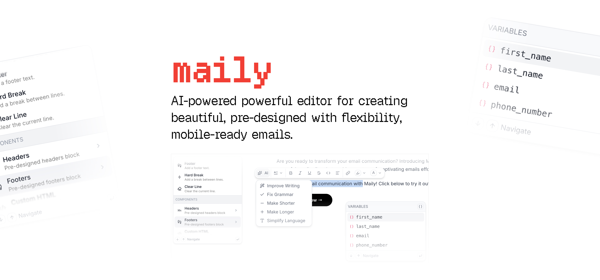

[](https://maily.to)

<p align="center">
  AI-powered powerful editor for creating beautiful,<br /> pre-designed with flexibility, mobile-ready emails.
</p>

<p align="center">
  <a href="https://github.com/arikchakma/maily.to/blob/main/license">
    
  </a>
  <a href="https://maily.to">
    	
  </a>
</p>

### Installation

```bash
pnpm add @maily-to/core

# for types
pnpm add -D @tiptap/core
```

### Quick Start

The editor uses a **compound component** pattern — compose `Editor.Root`, `Editor.Frame`, and `Editor.Content` to build your layout.

```tsx
import '@maily-to/core/style.css';

import { useState } from 'react';
import { Editor } from '@maily-to/core';
import type { Editor as TiptapEditor, JSONContent } from '@tiptap/core';

function App() {
  const [editor, setEditor] = useState<TiptapEditor>();

  return (
    <Editor.Root
      content={defaultContentJson}
      onCreate={({ editor }) => setEditor(editor)}
      onUpdate={({ editor }) => setEditor(editor)}
    >
      <Editor.Frame>
        <Editor.Content />
      </Editor.Frame>
    </Editor.Root>
  );
}
```

#### Editor Components

| Component          | Description                                                                   |
| ------------------ | ----------------------------------------------------------------------------- |
| `Editor.Root`      | Top-level provider. Accepts content, extensions, theme, and editor callbacks. |
| `Editor.Body`      | Applies theme CSS variables and body background/padding.                      |
| `Editor.Container` | Constrains content to the theme's max-width with padding.                     |
| `Editor.Content`   | Renders the Tiptap editor and all bubble menus.                               |
| `Editor.Frame`     | Convenience wrapper — renders `Body > Container` in one component.            |

`Editor.Frame` is shorthand for nesting `Body` and `Container`. Use the individual pieces when you need more control:

```tsx
<Editor.Root content={content}>
  <Editor.Body>
    <Editor.Container>
      <Editor.Content />
    </Editor.Container>
  </Editor.Body>
</Editor.Root>
```

#### Accessing the Editor Context

Use `useEditorRootContext` to access the theme and text direction from any child component:

```tsx
import { useEditorRootContext } from '@maily-to/core';

function MyComponent() {
  const { textDirection, setTextDirection, theme } = useEditorRootContext();
  // ...
}
```

### Toolbar

A composable toolbar with pre-built action buttons:

```tsx
import { Editor, Toolbar } from '@maily-to/core';

<Editor.Root content={content}>
  <Toolbar.Root>
    <Toolbar.CommonActions />
  </Toolbar.Root>
  <Editor.Frame>
    <Editor.Content />
  </Editor.Frame>
</Editor.Root>;
```

Or pick individual buttons:

```tsx
<Toolbar.Root>
  <Toolbar.Group>
    <Toolbar.Undo />
    <Toolbar.Redo />
  </Toolbar.Group>
  <Toolbar.Group>
    <Toolbar.Bold />
    <Toolbar.Italic />
    <Toolbar.Underline />
    <Toolbar.Strikethrough />
    <Toolbar.Code />
  </Toolbar.Group>
  <Toolbar.Align />
  <Toolbar.Direction />
</Toolbar.Root>
```

| Component                                                          | Description                                             |
| ------------------------------------------------------------------ | ------------------------------------------------------- |
| `Toolbar.Root`                                                     | Toolbar container with tooltip provider                 |
| `Toolbar.Group`                                                    | Visual grouping for buttons                             |
| `Toolbar.CommonActions`                                            | Pre-configured group with all common formatting actions |
| `Toolbar.Undo` / `Toolbar.Redo`                                    | History actions                                         |
| `Toolbar.Bold` / `Italic` / `Underline` / `Strikethrough` / `Code` | Mark toggles                                            |
| `Toolbar.Align`                                                    | Text alignment popover (left, center, right)            |
| `Toolbar.Direction`                                                | Text direction popover (LTR, RTL)                       |

### Slash Commands

Slash commands let you interact with the editor by typing `/` followed by a command name. Commands are organized into groups with a `title` and a `commands` array.

#### Basic Example

```tsx
import { text, heading1 } from '@maily-to/core/blocks';
import { SlashCommandExtension } from '@maily-to/core/extensions';

<Editor.Root
  extensions={[
    SlashCommandExtension.configure({
      commands: [text, heading1],
    }),
  ]}
>
  ...
</Editor.Root>;
```

> The order of the groups and commands determines how they are displayed in the editor.

#### Available Blocks

Import pre-built blocks from `@maily-to/core/blocks`:

**Typography:** `text`, `heading1`, `heading2`, `heading3`, `blockquote`, `footer`, `hardBreak`, `clearLine`

**Layout:** `spacer`, `divider`, `section`, `columns`, `repeat`, `htmlCodeBlock`

**Content:** `button`, `image`, `inlineImage`, `linkCard`, `bulletList`, `orderedList`

#### Grouped Commands with Subcommands

Define a command with an `id` and a `commands` array to create nested menus. Typing `/headers.` will show the subcommands.

```tsx
<Editor.Root
  blocks={[
    {
      title: 'Formatting',
      commands: [
        {
          title: 'Headers',
          id: 'headers',
          searchTerms: ['header', 'title'],
          commands: [
            {
              title: 'Heading 1',
              searchTerms: ['h1'],
              command: ({ editor, range }) => {
                editor
                  .chain()
                  .deleteRange(range)
                  .setHeading({ level: 1 })
                  .run();
              },
            },
          ],
        },
      ],
    },
  ]}
/>
```

> Currently supports one level of depth for subcommands.

#### Custom Rendered Blocks

Pass a `render` function to return custom JSX. Return `null` to skip rendering based on editor state.

```tsx
{
  title: 'Custom Block',
  searchTerms: ['custom'],
  render: (editor) => {
    return <div>Custom Block</div>;
  },
}
```

### Variables

Variables are dynamic placeholders (e.g. `{{name}}`) that get replaced at render time. Trigger the variable picker by typing the suggestion character (default `@`).

#### Array of Variables

```tsx
import { VariableExtension } from '@maily-to/core/extensions';

<Editor.Root
  extensions={[
    VariableExtension.configure({
      variables: [
        { id: 'currentDate' },
        { id: 'currentTime', required: false },
        { id: 'first_name', required: false, hideDefaultValue: true },
      ],
    }),
  ]}
>
  ...
</Editor.Root>;
```

When passing an array, Maily handles query filtering automatically. A dynamic entry is appended when no exact match exists, allowing users to create variables on the fly.

#### Function-based Variables

For dynamic variables based on editor state, pass a function:

```tsx
VariableExtension.configure({
  variables: ({ query, editor }) => {
    // You handle filtering yourself
    return [{ id: 'notifications' }, { id: 'comments' }];
  },
});
```

### Extensions

Extensions extend the editor's functionality. All Maily extensions are included by default — use the `extensions` prop to add more or override existing ones.

```tsx
import {
  VariableExtension,
  ImageUploadExtension,
  AIActions,
  InlineSuggestion,
} from '@maily-to/core/extensions';

<Editor.Root
  extensions={[
    VariableExtension.configure({ variables: [...] }),
    ImageUploadExtension.configure({
      onImageUpload: async (file) => {
        const url = await uploadImage(file);
        return url;
      },
    }),
  ]}
>
  ...
</Editor.Root>
```

#### Image Upload

Handle file drops and pastes with the `ImageUploadExtension`:

```tsx
import { ImageUploadExtension } from '@maily-to/core/extensions';

ImageUploadExtension.configure({
  onImageUpload: async (file, context) => {
    // context.position — insertion position in the document
    // context.removeImage() — call to remove the placeholder on failure
    const url = await uploadImage(file);
    return url;
  },
  onImageUploadError: (error, file, context) => {
    console.error('Upload failed:', error);
    context.removeImage();
  },
});
```

Supports `image/jpeg`, `image/png`, `image/gif`, `image/webp`, and `image/svg+xml`.

#### AI Actions

Add AI-powered content transformations (rewriting, summarizing, expanding):

```tsx
import { AIActions } from '@maily-to/core/extensions';
import type {
  AIActionsOptions,
  AIActionsTransformParams,
} from '@maily-to/core/extensions';
```

#### Inline Suggestions

Add ghost-text autocomplete suggestions (like AI code completion):

```tsx
import { InlineSuggestion } from '@maily-to/core/extensions';
import type { InlineSuggestionOptions } from '@maily-to/core/extensions';
```

### Theming

Customize the editor appearance through the `theme` prop on `Editor.Root`. Theme values are applied as CSS custom variables.

```tsx
<Editor.Root
  theme={{
    container: {
      backgroundColor: '#f9fafb',
      maxWidth: 640,
      borderRadius: 8,
      borderWidth: 1,
      borderColor: '#e5e7eb',
      paddingTop: 16,
      paddingRight: 16,
      paddingBottom: 16,
      paddingLeft: 16,
    },
    body: {
      backgroundColor: '#ffffff',
      paddingTop: 24,
      paddingRight: 24,
      paddingBottom: 24,
      paddingLeft: 24,
    },
    button: {
      backgroundColor: '#4f46e5',
      color: '#ffffff',
    },
    link: {
      color: '#2563eb',
    },
    font: {
      fontFamily: 'Inter',
      fallbackFontFamily: 'sans-serif',
      webFont: {
        format: 'woff2',
        url: 'https://cdn.usemaily.com/fonts/v0/inter.woff2',
      },
    },
  }}
>
  ...
</Editor.Root>
```

## Text Direction

The editor supports LTR and RTL text directions. Control it via props on `Editor.Root`:

```tsx
// Uncontrolled (editor manages state)
<Editor.Root defaultTextDirection="ltr">

// Controlled
<Editor.Root
  textDirection={direction}
  onTextDirectionChange={setDirection}
>
```

Use `Toolbar.Direction` to let users toggle direction from the toolbar.

## Entry Points

| Import path                 | Contents                                                                                                    |
| --------------------------- | ----------------------------------------------------------------------------------------------------------- |
| `@maily-to/core`            | `Editor`, `Toolbar`, `useEditorRootContext`, `useEditorVariables`, `filterVariableSuggestions`, theme types |
| `@maily-to/core/blocks`     | Pre-built slash command block items and types                                                               |
| `@maily-to/core/extensions` | All Tiptap extensions and their option/storage types                                                        |
| `@maily-to/core/style.css`  | Required CSS stylesheet                                                                                     |

See the [@maily-to/render](../render) package for converting editor content to HTML email templates.

### Sponsors

Sponsorship at any level is appreciated and encouraged. If you built a paid product using Maily, consider one of the [sponsorship tiers](https://github.com/sponsors/arikchakma).

<br/>

<h3 align="center">Gold</h3>

<table align="center" style="justify-content: center;align-items: center;display: flex;">
  <tr>
    <td align="center">
      <p></p>
      <p></p>
      <a href="https://novu.co?ref=maily.to">
        <picture height="60px">
          <source media="(prefers-color-scheme: dark)" srcset="https://github.com/user-attachments/assets/5e2b9ef1-5ded-4863-995d-62c7e40f946a">
          
        </picture>
      </a>
      <p></p>
      <p></p>
    </td>
  </tr>
</table>

<br/>

### License

MIT &copy; [Arik Chakma](https://twitter.com/imarikchakma)
